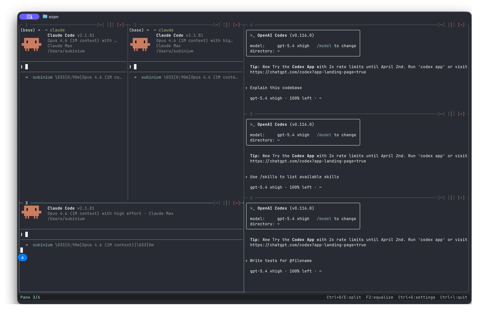

<p align="center">
  
</p>

# ezpn

Dead simple terminal pane splitting with session persistence. Think tmux, but instant.

[](LICENSE)
[](https://crates.io/crates/ezpn)
[]()

**English** | [한국어](docs/README.ko.md) | [日本語](docs/README.ja.md) | [中文](docs/README.zh.md) | [Español](docs/README.es.md) | [Français](docs/README.fr.md)

## Why ezpn?

```bash
# tmux: 4 steps
tmux new-session -d -s dev
tmux split-window -h
tmux split-window -v
tmux attach -t dev

# ezpn: 1 step
ezpn -l ide
```

- **Zero config** — Works out of the box. No `.tmux.conf` needed.
- **Instant layouts** — `ezpn -l ide` gives you an IDE layout in one command.
- **Session persistence** — `Ctrl+B d` to detach, `ezpn a` to reattach. Processes keep running.
- **Mouse-first** — Click to focus, drag to resize, scroll to browse output.
- **Project-aware** — Drop `.ezpn.toml` in your project root, run `ezpn`, done.

## Install

```bash
cargo install ezpn
```

Or build from source:

```bash
git clone https://github.com/subinium/ezpn
cd ezpn && cargo install --path .
```

## Quick Start

```bash
ezpn                    # 2 panes (or load .ezpn.toml)
ezpn 2 3                # 2x3 grid (6 panes)
ezpn -l ide             # IDE layout preset
ezpn -e 'npm dev' -e 'cargo watch -x test'   # per-pane commands
```

### Sessions (tmux-compatible)

```bash
ezpn                    # Creates a session + attaches
# Ctrl+B d              # Detach (session keeps running in background)
ezpn a                  # Reattach to most recent session
ezpn ls                 # List active sessions
ezpn kill myproject     # Kill a session
ezpn -S myproject       # Create a named session
ezpn rename old new     # Rename a session
```

### Tabs (tmux windows)

| Key | Action |
|-----|--------|
| `Ctrl+B c` | New tab |
| `Ctrl+B n` / `p` | Next / previous tab |
| `Ctrl+B 0-9` | Jump to tab by number |
| `Ctrl+B ,` | Rename current tab |
| `Ctrl+B &` | Close current tab |

Tab bar appears automatically when you have 2+ tabs. Click tabs to switch.

### Command Palette

`Ctrl+B :` opens a command prompt (like tmux/vim). Commands:

```
split                  Split horizontally (alias: split-window)
split -v               Split vertically
new-tab                Create new tab (alias: new-window)
next-tab / prev-tab    Switch tabs (alias: next-window / previous-window)
close-pane             Close active pane (alias: kill-pane)
close-tab              Close current tab (alias: kill-window)
rename-tab <name>      Rename tab (alias: rename-window)
layout <spec>          Change layout (alias: select-layout)
equalize               Equalize pane sizes (alias: even)
zoom                   Toggle zoom
broadcast              Toggle broadcast mode
```

All tmux command aliases (`split-window`, `kill-pane`, `new-window`, etc.) are supported for muscle memory compatibility.

## Controls

### Mouse

| Action | Effect |
|--------|--------|
| Click pane | Focus |
| Double-click | Zoom toggle |
| Click tab bar | Switch tab |
| Click `[x]` | Close pane |
| Drag border | Resize |
| Drag text | Select + copy (OSC 52) |
| Scroll wheel | Scrollback history |

### Keyboard

**Direct shortcuts:**

| Key | Action |
|-----|--------|
| `Ctrl+D` | Split left / right |
| `Ctrl+E` | Split top / bottom |
| `Ctrl+N` | Next pane |
| `F2` | Equalize all sizes |
| `Ctrl+G` | Settings panel |
| `Ctrl+W` | Kill session |

**Prefix mode (`Ctrl+B` then):**

| Key | Action |
|-----|--------|
| **Tabs** | |
| `c` | New tab |
| `n` / `p` | Next / previous tab |
| `0-9` | Go to tab |
| `,` | Rename tab |
| `&` | Close tab |
| **Panes** | |
| `%` / `"` | Split H / V |
| `o` / Arrow | Next / navigate pane |
| `x` | Close pane |
| `z` | Zoom toggle |
| `{` / `}` | Swap pane prev / next |
| `E` / Space | Equalize |
| **Modes** | |
| `R` | Resize mode (hjkl/arrows, q to exit) |
| `[` | Copy mode (vi keys, v select, y copy, / search) |
| `B` | Broadcast (type in all panes) |
| `:` | Command palette |
| `?` | Help overlay |
| **Session** | |
| `d` | Detach (session keeps running) |
| `s` | Toggle status bar |
| `q` | Pane numbers + quick jump |

<details>
<summary>macOS: Alt+Arrow for directional navigation</summary>

`Alt+Arrow` navigates between panes directionally. This requires your terminal to send Option as Meta:

- **iTerm2**: Preferences > Profiles > Keys > Left Option Key > `Esc+`
- **Terminal.app**: Settings > Profiles > Keyboard > Use Option as Meta Key
- **Ghostty**: Works by default
</details>

## Copy Mode (vi keys)

`Ctrl+B [` enters copy mode — navigate scrollback, select text, search, and copy to clipboard.

**Navigation:**

| Key | Action |
|-----|--------|
| `h` `j` `k` `l` | Move cursor |
| `w` / `b` | Next / previous word |
| `0` / `$` / `^` | Line start / end / first non-blank |
| `g` / `G` | Top / bottom of scrollback |
| `Ctrl+U` / `Ctrl+D` | Half page up / down |
| `H` / `M` / `L` | Viewport top / middle / bottom |

**Selection & Copy:**

| Key | Action |
|-----|--------|
| `v` | Start character selection |
| `V` | Start line selection |
| `y` / `Enter` | Copy selection to clipboard (OSC 52) and exit |

**Search:**

| Key | Action |
|-----|--------|
| `/` | Forward search (incremental, case-insensitive) |
| `?` | Backward search |
| `n` / `N` | Next / previous match |
| `q` / `Esc` | Exit copy mode |

## Layout Presets

```bash
ezpn -l dev       # 7:3 — main + side
ezpn -l ide       # 7:3/1:1 — editor + sidebar + 2 bottom
ezpn -l monitor   # 1:1:1 — 3 equal columns
ezpn -l quad      # 2x2 grid
ezpn -l stack     # 1/1/1 — 3 stacked rows
ezpn -l main      # 6:4/1 — wide top pair + full bottom
ezpn -l trio      # 1/1:1 — full top + 2 bottom
```

Custom ratios: `ezpn -l '7:3/5:5'` — 2 rows, first 70/30, second 50/50.

Presets work in `.ezpn.toml` too: `layout = "ide"`.

## Project Config (.ezpn.toml)

Drop `.ezpn.toml` in your project root. Run `ezpn init` to generate a template.

```toml
[workspace]
layout = "ide"

[[pane]]
name = "server"
command = "npm run dev"
cwd = "./frontend"
restart = "on_failure"

[pane.env]
NODE_ENV = "development"
PORT = "3000"

[[pane]]
name = "tests"
command = "cargo watch -x test"
restart = "always"

[[pane]]
name = "logs"
command = "tail -f /var/log/app.log"
shell = "/bin/bash"
```

**Per-pane fields:** `command`, `cwd`, `name`, `env`, `restart` (`never`/`on_failure`/`always`), `shell`.

Also auto-detects `Procfile` when no `.ezpn.toml` exists:

```bash
ezpn from Procfile   # Generate .ezpn.toml from Procfile
```

## Global Config

`~/.config/ezpn/config.toml`:

```toml
border = rounded        # single | rounded | heavy | double | none
shell = /bin/zsh
scrollback = 10000
status_bar = true
tab_bar = true
prefix = b              # prefix key (Ctrl+<key>), default: b
```

## Options

| Flag | Description | Default |
|------|-------------|---------|
| `-l, --layout <SPEC>` | Layout spec or preset | — |
| `-e, --exec <CMD>` | Command per pane (repeatable) | `$SHELL` |
| `-S, --session <NAME>` | Custom session name | auto from dir |
| `-r, --restore <FILE>` | Restore workspace snapshot | — |
| `-b, --border <STYLE>` | Border style | `rounded` |
| `-d, --direction <DIR>` | `h` or `v` | `h` |
| `-s, --shell <SHELL>` | Shell path | `$SHELL` |
| `--no-daemon` | Single-process mode (no detach) | — |

## Session Management

ezpn runs as a daemon by default. When you run `ezpn`, it:
1. Starts a background server (manages PTYs)
2. Connects a thin client (renders + handles input)
3. `Ctrl+B d` detaches the client; server keeps running
4. `ezpn a` reconnects

```bash
ezpn ls                 # List sessions
ezpn a [name]           # Attach (most recent, or by name)
ezpn kill [name]        # Kill session (most recent, or by name)
ezpn rename old new     # Rename session
ezpn -S myproject       # Start with custom name
ezpn init               # Generate .ezpn.toml template
ezpn from Procfile      # Generate .ezpn.toml from Procfile
```

Multiple sessions are supported. `ezpn a` without a name attaches to the most recently used session.

## Features

**Broadcast mode** — `Ctrl+B B` sends keystrokes to all panes simultaneously. All borders turn orange. Press again to stop.

**Mouse wheel scrollback** — Scroll through terminal output. `[SCROLL]` indicator in title bar. New output snaps back to live.

**Auto-restart** — Panes with `restart = "on_failure"` or `"always"` in `.ezpn.toml` respawn automatically with backoff.

**Text selection** — Drag to select text in any pane. Copies via OSC 52 (works over SSH).

**OSC 52 passthrough** — Clipboard operations from child processes (vim, neovim) are forwarded to your terminal.

**Focus events** — `FocusIn`/`FocusOut` forwarded to active pane. vim auto-reloads on focus.

**Bracketed paste** — Paste operations are properly wrapped when the child process requests it.

**Kitty keyboard protocol** — `Shift+Enter`, `Ctrl+Arrow`, and other modified keys work correctly. (Requires Ghostty/Kitty/WezTerm)

**24-bit color** — Full truecolor support. `COLORTERM=truecolor` set automatically.

**CJK/Unicode** — Proper width calculation for Korean, Chinese, Japanese characters and emoji.

**Borderless mode** — `ezpn -b none` removes the outer frame for maximum screen space. Panes are separated by thin vertical lines with a colored title strip. 10% more usable area than bordered mode.

**Configurable prefix key** — Change the prefix from `Ctrl+B` to any key in `~/.config/ezpn/config.toml`:
```toml
prefix = a   # Ctrl+A becomes the prefix key
```

**Dead pane recovery** — Process exits show dimmed overlay. Press `Enter` to respawn.

**Settings panel** — `Ctrl+G` opens a modal for border style, status bar toggle, split actions.

**Border styles** — `--border` or change in settings:

```
single           rounded (default) heavy            double           none (borderless)
┌──────┬──────┐  ╭──────┬──────╮  ┏━━━━━━┳━━━━━━┓  ╔══════╦══════╗
│      │      │  │      │      │  ┃      ┃      ┃  ║      ║      ║
└──────┴──────┘  ╰──────┴──────╯  ┗━━━━━━┻━━━━━━┛  ╚══════╩══════╝
```

## ezpn-ctl (IPC)

Control a running instance from another terminal:

```bash
ezpn-ctl list                    # List panes
ezpn-ctl split horizontal       # Split active pane
ezpn-ctl exec 1 'cargo test'    # Run command in pane 1
ezpn-ctl save session.json      # Save workspace
ezpn-ctl load session.json      # Restore workspace
```

## vs. tmux / Zellij

|  | tmux | Zellij | ezpn |
|---|---|---|---|
| First use | Empty screen, read docs | Tutorial mode | `ezpn -l ide` |
| Config | `.tmux.conf` required | KDL files | Works out of the box |
| Sessions | `tmux a` | `zellij a` | `ezpn a` |
| Split | `Ctrl+B %` | Mode switch | `Ctrl+D` / click |
| Resize | `:resize-pane` | Resize mode | Drag / `Ctrl+B R` |
| Project setup | tmuxinator (gem) | — | `.ezpn.toml` (built-in) |
| Broadcast | `:setw synchronize-panes` | — | `Ctrl+B B` |
| Auto-restart | — | — | `restart = "always"` |
| Scrollback | `Ctrl+B [` | Scroll mode | Mouse wheel |
| Kitty keyboard | Not supported | Supported | Supported |
| Render quality | May tear | Synchronized | Synchronized |
| Plugin system | — | WASM | — |
| Ecosystem | Massive (30 years) | Growing | New |

**Choose ezpn** when you want terminal splits that just work — zero config, instant layouts, project-aware.

**Choose tmux** when you need maximum scripting, plugin ecosystem, or your team already uses it.

**Choose Zellij** when you want a modern UI with plugin extensibility.

## Architecture

```
src/
├── main.rs        CLI routing, direct mode, shared helpers
├── server.rs      Daemon event loop (PTY management, rendering, client I/O)
├── client.rs      Thin terminal proxy (raw mode, event forwarding)
├── protocol.rs    Binary wire protocol (TLV framing)
├── session.rs     Session naming, discovery, daemon spawning
├── tab.rs         Tab (window) manager with save/restore
├── copy_mode.rs   Vi-style copy mode (selection, search, clipboard)
├── layout.rs      Binary split tree + named presets
├── pane.rs        PTY + VT100 emulation + scrollback + input encoding
├── render.rs      Incremental render + border cache + tab bar + status bar
├── settings.rs    Settings modal UI
├── project.rs     .ezpn.toml parsing + Procfile import
├── ipc.rs         JSON IPC for ezpn-ctl
├── workspace.rs   Snapshot save/load
├── config.rs      Global config (~/.config/ezpn/config.toml)
└── bin/ezpn-ctl.rs  External control client
```

The server renders frames server-side with `BeginSynchronizedUpdate`/`EndSynchronizedUpdate` to prevent tearing. Only dirty panes are redrawn. Border geometry is cached and recomputed only on layout changes. The wire protocol uses 5-byte TLV headers with zero-copy frame transfer.

## License

[MIT](LICENSE)
