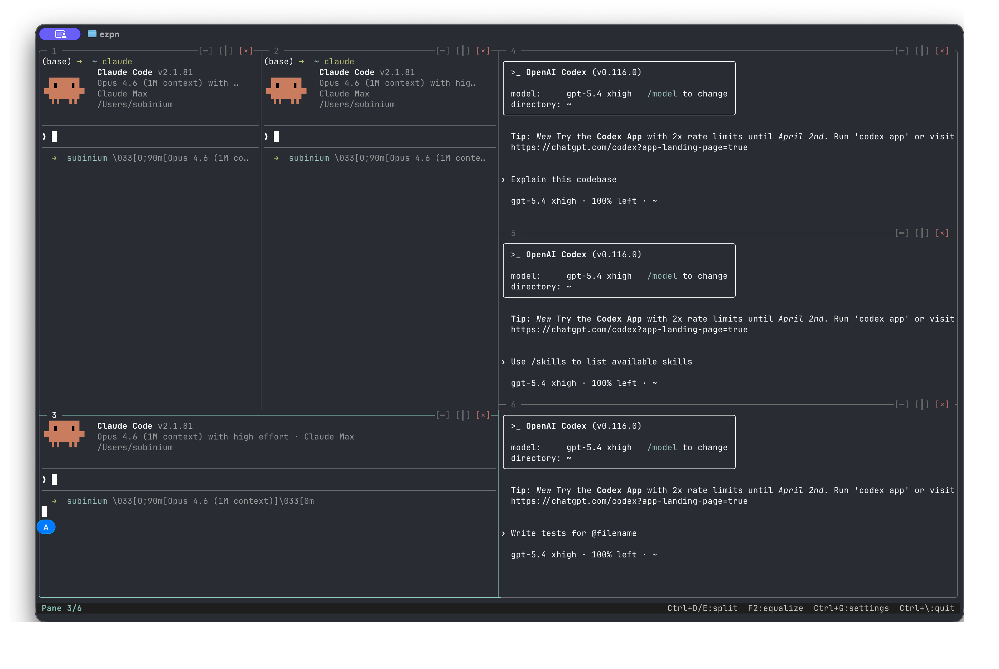

<p align="center">
  
</p>

<h1 align="center">ezpn</h1>

<p align="center">
  <strong>Panneaux de terminal, instantanément.</strong><br>
  Multiplexeur de terminal pour macOS et Linux, adapté à la souris, avec des sessions persistantes et des touches de préfixe familières.
</p>

<p align="center">
  <a href="https://crates.io/crates/ezpn"></a>
  <a href="../LICENSE"></a>
  <a href="https://github.com/subinium/ezpn/actions"></a>
  
</p>

<p align="center">
  <a href="../README.md">English</a> | <a href="README.ko.md">한국어</a> | <a href="README.ja.md">日本語</a> | <a href="README.zh.md">中文</a> | <a href="README.es.md">Español</a> | <b>Français</b>
</p>

---

## Commencer à travailler

```sh
cargo install ezpn --locked
ezpn                 # two shells
ezpn 2 3             # a 2-by-3 grid
ezpn -S work         # create or reattach to a named session
```

La compilation nécessite Rust 1.88 ou une version ultérieure. [GitHub Releases](https://github.com/subinium/ezpn/releases)
propose des binaires pour macOS et Linux ; vérifiez les sommes de contrôle lorsqu'elles sont fournies.
ezpn est un multiplexeur de terminal exécutable, pas une bibliothèque GUI à intégrer dans Rust.

## Sessions et SSH

```sh
ezpn a work
ezpn a work --shared
ezpn a work --readonly
ezpn ls
ezpn kill work
```

Appuyez sur `Ctrl+B`, puis sur `d`, pour détacher uniquement votre client. Les processus shell restent actifs,
y compris les tâches des onglets inactifs. Une nouvelle connexion retrouve ces mêmes processus.
Les clients en lecture seule ne peuvent ni saisir du texte ni redimensionner l'espace de travail des clients autorisés à écrire.

Installez ezpn sur l'hôte distant et rendez-le accessible dans son PATH :

```sh
ssh -t host 'ezpn -S work'
ssh -t host 'ezpn a work'
ssh -J bastion -t host 'ezpn a work'
```

SSH doit allouer un PTY. La déconnexion du client SSH n'arrête pas le démon distant.
Le chiffrement, l'authentification, la vérification des clés d'hôte et les redirections relèvent d'OpenSSH.
N'exposez pas les sockets Unix locaux d'ezpn sur un réseau sans authentification.

## Souris et clavier

| Interaction | Résultat |
| --- | --- |
| Cliquer dans un panneau | Donner le focus au panneau |
| Faire glisser un séparateur | Redimensionner la division |
| Boutons de division de la barre de titre | Diviser le panneau sélectionné |
| Bouton de fermeture de la barre de titre | Demander confirmation avant de fermer |
| Cliquer sur un onglet | Changer d'onglet |
| Faire défiler | Parcourir l'historique ou transmettre à une application prenant en charge la souris |
| Faire glisser du texte | Sélectionner et copier |
| Shift + glisser | Sélectionner le texte d'ezpn au lieu d'envoyer des événements souris à l'application |
| Double-cliquer dans une application ne gérant pas la souris | Basculer le zoom |
| F1 / F2 | Réglages / égaliser les tailles |
| Alt + flèches | Passer d'un panneau à l'autre ; configurer Option comme Meta sur macOS |

Les clics, mouvements, événements de molette et relâchements de boutons utilisent l'encodage souris demandé par l'application.
Les touches telles que `Ctrl+D`, `Ctrl+E` et `Ctrl+W` sont transmises au shell, sauf réaffectation explicite.
Elles ne divisent plus les panneaux et ne demandent plus l'arrêt.

Appuyez sur `Ctrl+B`, puis sur :

| Touche | Action |
| --- | --- |
| `%` / `"` | Diviser en colonnes / lignes |
| `o` / flèches | Passer d'un panneau à l'autre |
| `x` | Confirmer la fermeture du panneau |
| `z` | Basculer le zoom |
| `R` | Mode redimensionnement |
| `Space` / `E` | Égaliser les tailles |
| `c` / `n` / `p` | Nouvel onglet / suivant / précédent |
| `0`–`9` | Sélectionner un onglet par son indice, à partir de zéro |
| `,` / `&` | Renommer / confirmer la fermeture de l'onglet |
| `[` | Mode copie |
| `:` | Palette de commandes |
| `r` | Recharger la configuration globale |
| `B` | Basculer la saisie simultanée dans plusieurs panneaux |
| `d` | Détacher ce client |
| `?` | Aide |
| `Ctrl+B` | Envoyer la touche de préfixe à l'application |

Le mode copie permet la navigation vi, la sélection avec `v`/`V`, la copie avec `y` ou Entrée,
la recherche avec `/`/`?`, le passage au résultat suivant/précédent avec `n`/`N` et la sortie avec `q`/Échap.
La prise en charge de raccourcis tmux courants ne signifie pas une compatibilité complète avec les commandes tmux.

## Changer la disposition sans perdre son travail

```sh
ezpn -l dev       # 7:3
ezpn -l ide       # 7:3/1:1
ezpn -l quad      # 2-by-2
ezpn -l '7:3/5:5'
ezpn -b none
```

Dans la palette de commandes, `select-layout` réorganise les processus existants.
Il refuse les dispositions dont le nombre de panneaux diffère ; divisez ou fermez les panneaux explicitement.
Un échec de division ou de chargement d'instantané ne détruit pas l'espace de travail actuel.

## Espaces de travail de projets de confiance

Examinez les commandes du dépôt avant d'autoriser leur exécution au démarrage :

```toml
# .ezpn.toml
[workspace]
layout = "7:3"

[[pane]]
name = "shell"
cwd = "."

[[pane]]
name = "worker"
command = "printf 'ready\\n'; exec sh"
restart = "on_failure"
```

```sh
ezpn init
ezpn doctor
ezpn --trust-project
```

`--trust-project` autorise l'exécution automatique de `.ezpn.toml` / Procfile.
Pour démarrer des shells ordinaires sans charger les commandes du dépôt, indiquez une grille explicite, par exemple `ezpn 1 2`.
`doctor` vérifie la syntaxe en lecture seule, sans exécuter de commandes ni résoudre les secrets.

L'interpolation des variables du projet accepte les références à l'environnement, aux fichiers et aux secrets.
Les valeurs externes ne sont jamais affichées dans les diagnostics. Les panneaux dont la configuration lit des valeurs externes
sont exclus des métadonnées d'exécution et de l'historique des instantanés : leur restauration ouvre des shells vierges.
Ce choix privilégie volontairement la confidentialité plutôt que l'enregistrement silencieux d'identifiants résolus.
Consultez la [configuration](../docs/configuration.md) et la [sécurité](../docs/security.md).

## Configuration et récupération

```toml
# ~/.config/ezpn/config.toml
[global]
border = "rounded"
scrollback = 10000
persist_scrollback = false

[keys]
prefix = "b"

[theme]
name = "ezpn-dark"
```

Thèmes : `ezpn-dark`, `ezpn-light`, `nord`, `gruvbox-dark`, `solarized-dark`.
Les raccourcis utilisateur sont définis dans `[keymap.normal]`, `[keymap.prefix]` et `[keymap.copy_mode]`.
`Ctrl+B r` recharge les champs pris en charge à partir d'une seule lecture validée du fichier.
Si l'enregistrement échoue dans le panneau de réglages, l'erreur est signalée au lieu d'afficher un succès.

Un instantané sur disque est distinct d'une session active dont le client est détaché.
`ezpn --restore FILE` **démarre de nouveaux processus**. L'historique dont la sauvegarde a été activée se restaure sous forme de texte,
pas sous forme d'éditeur en cours d'exécution, de mémoire de processus, de graphismes du terminal ou d'état exact de l'écran alternatif.
Les instantanés ont des limites de taille et de décompression, ainsi que des permissions d'accès restreintes.

## Compatibilité et preuves

- La prise en charge vise macOS et Linux avec un terminal ANSI UTF-8 et des PTY Unix.
  Windows natif n'est pas pris en charge.
- La négociation du clavier de l'application enfant est distincte des capacités de l'hôte.
  Les applications classiques reçoivent les séquences classiques ; les extensions Kitty prises en charge sont facultatives.
- Les écritures des applications dans le presse-papiers suivent la politique OSC 52 configurée.
  Par SSH, les copies de l'utilisateur privilégient le terminal connecté plutôt que le presse-papiers du bureau distant.
- Le rendu est borné et les zones d'affichage très petites sont rognées. La [compatibilité des terminaux](../docs/terminal-protocol.md)
  décrit les limites du parseur, les séquences prises en charge et les combinaisons d'émulateurs GUI non testées.
- `--features render-diff` active un chemin facultatif et borné de sortie différentielle ANSI.
  Les trames non prises en charge reviennent à la sortie d'origine. Ce n'est pas une garantie de vitesse universelle.
- Les tests sur de vrais PTY couvrent l'attachement/détachement, le redimensionnement, les clients partagés/en lecture seule et les transports interrompus.
  Un test SSH isolé en boucle locale distingue une vraie connexion SSH d'une simulation.
- Les tests prolongés de stabilité et les comparaisons de performances avec tmux/Zellij constituent des preuves distinctes.
  ezpn ne prétend pas être toujours plus rapide ni moins gourmand en mémoire que ces deux projets.

L'[audit de la version](../docs/audits/v0.14.0.md) consigne les résultats et les limites restantes.
Le [script de vérification préalable](../scripts/preflight.py) enregistre PASS/FAIL/SKIP et les codes de sortie réels ;
les tests en échec ne sont pas cachés derrière des tests de substitution ignorés.

## Documentation

[Premiers pas](../docs/getting-started.md) · [Configuration](../docs/configuration.md) ·
[SSH et protocoles de terminal](../docs/terminal-protocol.md) · [Presse-papiers](../docs/clipboard.md) ·
[Sécurité](../docs/security.md) · [Limites de scripting](../docs/scripting.md) ·
[Contribuer](../CONTRIBUTING.md) · [Journal des modifications](../CHANGELOG.md)

## Licence

[MIT](../LICENSE)
